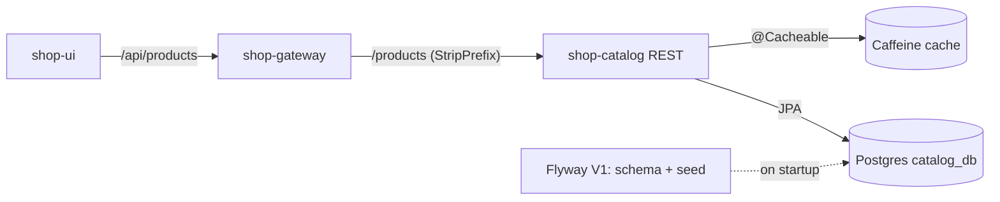
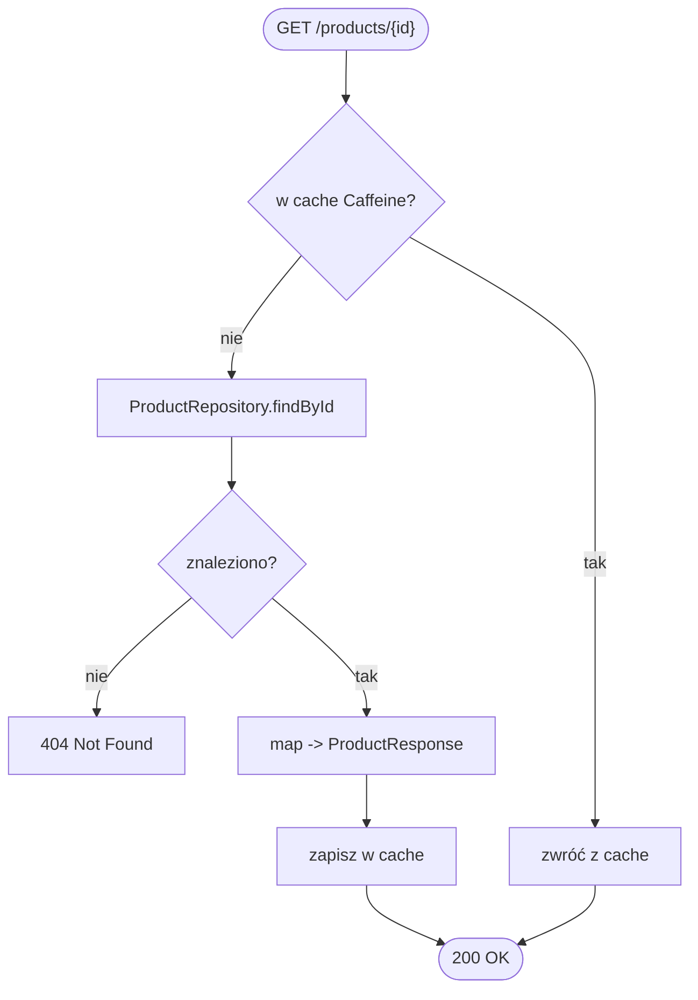

# shop-catalog

Serwis przeglądania oferty — typowo *read-heavy*. Świadomie **nie** zarządza
stanem magazynowym (od tego jest shop-inventory). Standalone repo z własnym
`Dockerfile` i kodem. Stack: Spring Boot + Spring Data JPA (Postgres) + cache.

## Baza
`catalog_db`: `products(id, name, description, price, image_url, category_id)`,
`categories`. Migracje przez Flyway/Liquibase.

## API do zaimplementowania

| Metoda | Ścieżka                  | Opis                          |
|--------|--------------------------|-------------------------------|
| GET    | `/products`              | lista z paginacją i filtrami  |
| GET    | `/products/{id}`         | szczegóły produktu            |
| GET    | `/products/search?q=...` | wyszukiwanie                  |

Dostępność sztuk nie pochodzi stąd — frontend pobiera ją z shop-inventory.

## Cache
Read-heavy → cache (Spring Cache + Redis lub Caffeine) na produkty i listy,
z inwalidacją przy zmianie. Zdejmuje ruch z Postgresa przy szczycie.

## Kafka (opcjonalnie)
Może publikować `ProductCreated/Updated` lub konsumować `inventory-events`, by
aktualizować flagę dostępności. Dla MVP można pominąć.

## Skalowanie
Bezstanowy, mocno cache'owany → wiele instancji + read replicas. Najłatwiejszy do
skalowania serwis w systemie.

## Konfiguracja (env)
`SPRING_DATASOURCE_URL=jdbc:postgresql://postgres:5432/catalog_db`,
`SPRING_DATA_REDIS_HOST=redis`, `SPRING_KAFKA_BOOTSTRAP_SERVERS=shop-kafka:9092`,
`SERVER_PORT=8080`.

## High Level Design (ogólny workflow)

Serwis *read-heavy*: synchroniczne REST przez gateway. Odczyt najpierw trafia w
cache (Caffeine), a przy pudle do Postgresa. Brak Kafki w MVP. Flyway zakłada
schemat i seed przy starcie.

## Low Level Design (diagram aktywności)

Obsługa `GET /products/{id}`:

